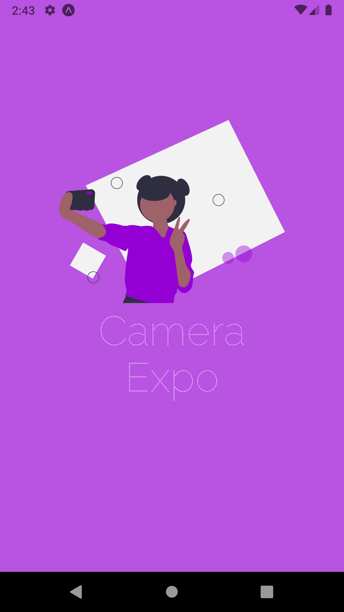

<div align="center">
  <h1> 
      
    SmartPaper
  </h1>

  📱 Aplicação que lida com a camera do seu celular utilizando a API de Camera do Expo


  <a href="https://expo.io/@leandro_viana/projects/Camera-Expo">
    
  </a>

  <a href="./LICENSE.md">
    
  </a>

</div>
<br>

<div align="center">
  
</div>

<br>

## 🏭 Tecnologias Utilizadas

O Projeto foi construído usando as seguintes tecnologias e ferramentas:
- **[Typescript](https://www.typescriptlang.org/)**
- **[React Native](https://reactnative.dev/)**
- **[Expo](https://expo.io/)**
- **[React Navigation](https://reactnavigation.org/)**
- **[Eslint](https://eslint.org/)**


## 🎳 Colocando pra rodar

Para iniciar a aplicação com Expo siga os passos após clonar o projeto

```bash
# Entre na pasta mobile
$ cd mobile

# Instale as dependências
$ npm install

# Execute com o expo
$ npm start

```

Após seguir esses passos irá aparecer um QRCode que você pode escanear utilizando o app **Expo go** ou pode clicar na letra `a` para abrir no emulador do android caso tenha instalado

## 📖 Licença

Realizado em 2021

Esse projeto está licenciado pela MIT LICENSE. Para mais informações, leia o arquivo [LICENSE](./LICENSE.md).